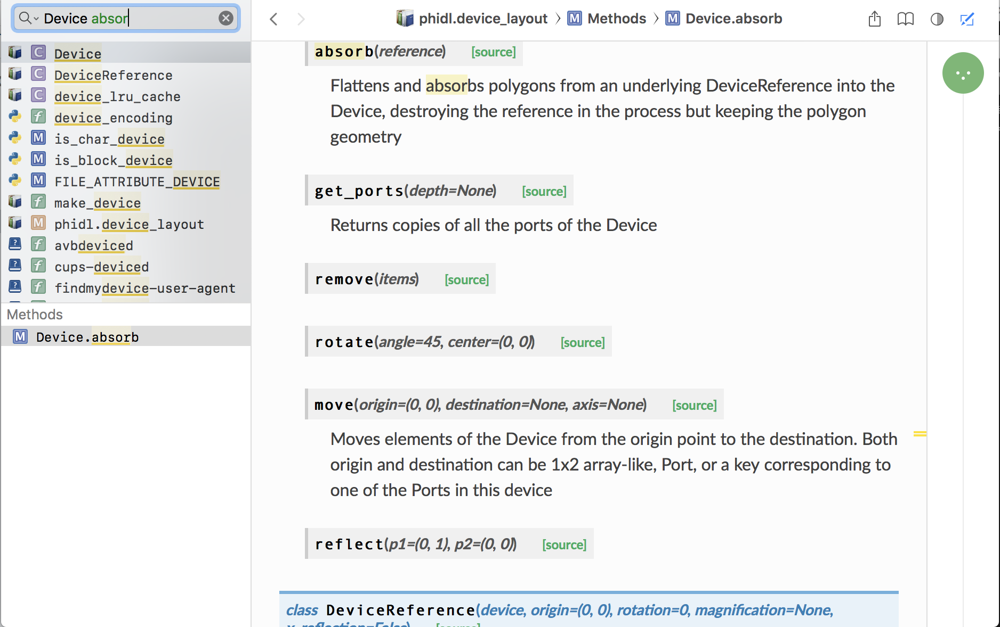

This is an example page with some unrelated tips
================================================

Dash integration
****************
An advantage of having this documentation is that is works with a program called `Dash <https://kapeli.com/dash>`_, a tool for searching APIs. It integrates with other programs, so that you can select a word anywhere, press some hotkey, and Dash will look up that function/class/module in this documentation.

    ``phidl`` in Dash

First, install Dash.app from the website.

Then install the project `doc2dash <https://github.com/hynek/doc2dash>`_ (`Documentation <https://doc2dash.readthedocs.io/en/stable/#>`_) with the command::

    pip install doc2dash

Next, build the documentation. Finally, install it into Dash.app with::

    doc2dash -n phidl -A docs/_build/html/

Tips on documenting code
************************
Documentation of API is autogenerated. That means whatever you put in the code docstrings will end up formatted nicely on this site (and in Dash.app); however, it has to follow some rules.

(Note: this example inspired by the `lightlab <http://lightlab.readthedocs.io>`_ `documentation on documentation <http://lightlab.readthedocs.io/en/master/_static/developers/docYourCode.html>`_)

Function declarations go like this::

    def foo(a, b, *args):
        ''' My cool function
            << Blank line causes a rendered line break >>
            This function does some stuff with ``a`` and ``b``:
                * one thing
                * another thing
            << Blank line after indented thing, otherwise you get Warnings >>
            Pretty neat eh?
            << Blank line before argument list, otherwise you get Warnings >>
            Args:
                a (int): an input
                b (int): another input
                \*args: more inputs

            Returns:
                (int): an output
        '''

This is called Google docstring format. It will render as follows.

.. py:function:: foo(a, b, *args)

    My cool function

    This function does some stuff with ``a`` and ``b``:
        * one thing
        * another thing

    Pretty neat eh?

    :param int a: an input
    :param int b: another input
    :param \*args: more inputs
    :returns: an output

Real examples can be found by browsing the API section of this documentation. If you see something you like, click on the link to view the source. Then you can see how the docstring did that.

