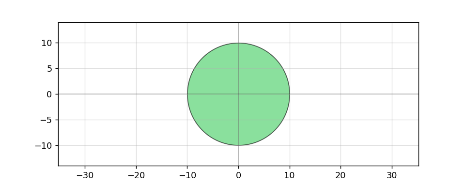
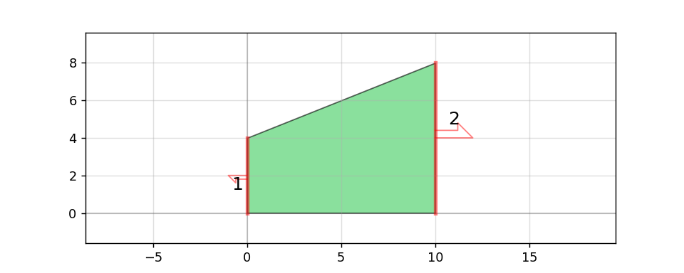
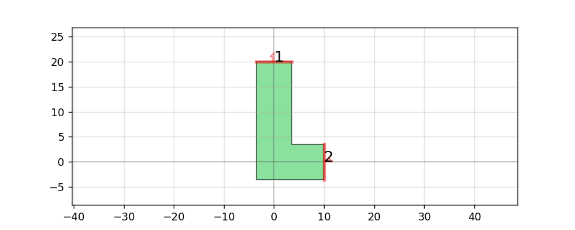
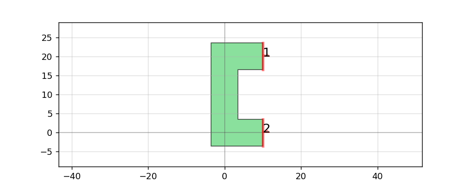
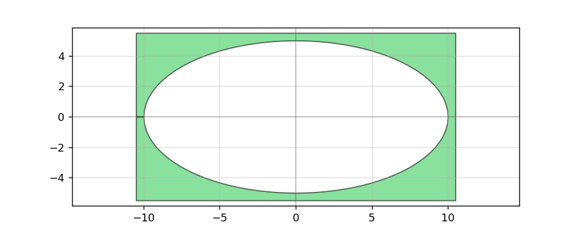
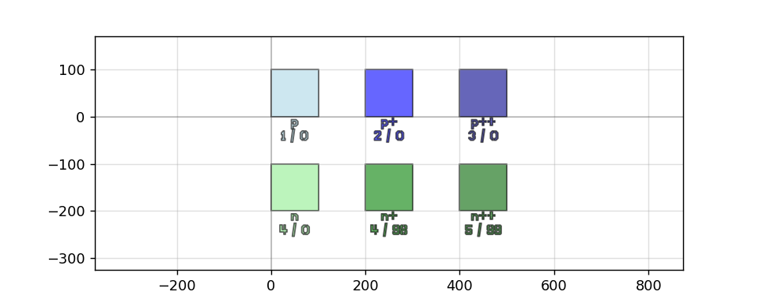
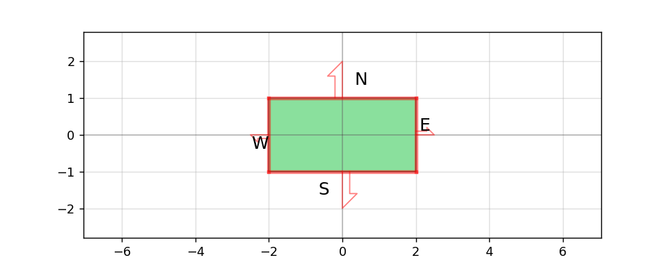

.. phidl documentation master file, created by
   sphinx-quickstart on Sat Nov  2 18:17:54 2019.
   You can adapt this file completely to your liking, but it should at least
   contain the root `toctree` directive.

Note: This is still a work-in-progress and is currently meant only as a geometry reference for built-in shapes in the phidl.geometry (pg) library. For a more complete tutorial please see the tutorial here https://github.com/amccaugh/phidl/blob/master/phidl/phidl_tutorial_example.py

###############
Basic shapes
###############

***********
Rectangle
***********

To create a simple rectangle, there are two functions.  The first is `pg.rectangle()` which creates a basic rectangle:

.. literalinclude:: gen_geometry.py
   :language: python
   :dedent: 0
   :start-after: example-rectangle
   :end-before: create_image

.. image:: _static/rectangle.png
   :align: center

The other way to create a rectangle is to define one by its bounding box.  This is useful if you want to create a rectangle which exactly surrounds a piece of existing geometry.  For example, if we have an arc geometry and we want to define a box around it, we can use `pg.bbox()`: 

.. literalinclude:: gen_geometry.py
   :language: python
   :dedent: 0
   :start-after: example-bbox
   :end-before: create_image

.. image:: _static/bbox.png
   :align: center

***********
Cross
***********

The `pg.cross()` function creates a cross structure:

.. literalinclude:: gen_geometry.py
   :language: python
   :dedent: 0
   :start-after: example-cross
   :end-before: create_image

.. image:: _static/cross.png
   :align: center

***********
Ellipse
***********

The `pg.ellipse()` function creates an ellipse by defining the major and minor radii:

.. literalinclude:: gen_geometry.py
   :language: python
   :dedent: 0
   :start-after: example-ellipse
   :end-before: create_image

.. image:: _static/ellipse.png
   :align: center

***********
Circle
***********

The `pg.circle()` function creates a circle:

.. literalinclude:: gen_geometry.py
   :language: python
   :dedent: 0
   :start-after: example-circle
   :end-before: create_image

***********
Ring
***********

The `pg.ring()` function creates a ring.  The radius refers to the center radius of the ring structure (halfway between the inner and outer radius).

.. literalinclude:: gen_geometry.py
   :language: python
   :dedent: 0
   :start-after: example-ring
   :end-before: create_image

.. image:: _static/ring.png
   :align: center

***********
Arc
***********

The `pg.arc()` function creates an arc.  The radius refers to the center radius of the arc (halfway between the inner and outer radius).  The arc has two ports, `1` and `2`, on either end, allowing you to easily connect it to other structures.

.. literalinclude:: gen_geometry.py
   :language: python
   :dedent: 0
   :start-after: example-arc
   :end-before: create_image

***********
Tapers
***********

The taper is defined by setting its length and its start and end length.  It has two ports, `1` and `2`, on either end, allowing you to easily connect it to other structures.

.. literalinclude:: gen_geometry.py
   :language: python
   :dedent: 0
   :start-after: example-taper
   :end-before: create_image

.. image:: _static/taper.png
   :align: center

The ramp structure is similar to the taper except it is asymmetric.  It also has two ports, `1` and `2`, on either end.

.. literalinclude:: gen_geometry.py
   :language: python
   :dedent: 0
   :start-after: example-ramp
   :end-before: create_image

***********
Common compound shapes
***********

.. literalinclude:: gen_geometry.py
   :language: python
   :dedent: 0
   :start-after: example-L
   :end-before: create_image

.. literalinclude:: gen_geometry.py
   :language: python
   :dedent: 0
   :start-after: example-C
   :end-before: create_image

###############
Text
###############

PHIDL has an implementation of the DEPLOF font with the majority of english ASCII characters represented.

.. literalinclude:: gen_geometry.py
   :language: python
   :dedent: 0
   :start-after: example-text
   :end-before: create_image

.. image:: _static/text.png
   :align: center

###############
Boolean / outline / offset / invert
###############

***********
Boolean
***********

.. literalinclude:: gen_geometry.py
   :language: python
   :dedent: 0
   :start-after: example-boolean
   :end-before: create_image

.. image:: _static/boolean.png
   :align: center

***********
Offset
***********

.. literalinclude:: gen_geometry.py
   :language: python
   :dedent: 0
   :start-after: example-offset
   :end-before: create_image

.. image:: _static/offset.png
   :align: center

***********
Outline
***********

.. literalinclude:: gen_geometry.py
   :language: python
   :dedent: 0
   :start-after: example-outline
   :end-before: create_image

.. image:: _static/outline.png
   :align: center

***********
Invert
***********

.. literalinclude:: gen_geometry.py
   :language: python
   :dedent: 0
   :start-after: example-invert
   :end-before: create_image

***********
Union
***********

.. literalinclude:: gen_geometry.py
   :language: python
   :dedent: 0
   :start-after: example-union
   :end-before: create_image

.. image:: _static/union.png
   :align: center

***********
XOR / diff
***********

.. literalinclude:: gen_geometry.py
   :language: python
   :dedent: 0
   :start-after: example-xor_diff
   :end-before: create_image

.. image:: _static/xor_diff.png
   :align: center

###############
Lithography structures
###############

***********
Step-resolution
***********

.. literalinclude:: gen_geometry.py
   :language: python
   :dedent: 0
   :start-after: example-litho_steps
   :end-before: create_image

.. image:: _static/litho_steps.png
   :align: center

***********
Lithographic star
***********

.. literalinclude:: gen_geometry.py
   :language: python
   :dedent: 0
   :start-after: example-litho_star
   :end-before: create_image

.. image:: _static/litho_star.png
   :align: center

***********
Calipers (inter-layer alignment)
***********

.. literalinclude:: gen_geometry.py
   :language: python
   :dedent: 0
   :start-after: example-litho_calipers
   :end-before: create_image

.. image:: _static/litho_calipers.png
   :align: center

###############
Importing GDS files
###############

.. literalinclude:: gen_geometry.py
   :language: python
   :dedent: 0
   :start-after: example-import_gds
   :end-before: create_image

.. image:: _static/import_gds.png
   :align: center

.. literalinclude:: gen_geometry.py
   :language: python
   :dedent: 0
   :start-after: example-preview_layerset
   :end-before: create_image

###############
Useful contact pads / connectors
###############

.. literalinclude:: gen_geometry.py
   :language: python
   :dedent: 0
   :start-after: example-compass
   :end-before: create_image

.. literalinclude:: gen_geometry.py
   :language: python
   :dedent: 0
   :start-after: example-compass_multi
   :end-before: create_image

.. image:: _static/compass_multi.png
   :align: center

.. literalinclude:: gen_geometry.py
   :language: python
   :dedent: 0
   :start-after: example-flagpole
   :end-before: create_image

.. image:: _static/flagpole.png
   :align: center

.. literalinclude:: gen_geometry.py
   :language: python
   :dedent: 0
   :start-after: example-straight
   :end-before: create_image

.. literalinclude:: gen_geometry.py
   :language: python
   :dedent: 0
   :start-after: example-connector
   :end-before: create_image

.. image:: _static/connector.png
   :align: center

.. literalinclude:: gen_geometry.py
   :language: python
   :dedent: 0
   :start-after: example-tee
   :end-before: create_image

.. image:: _static/tee.png
   :align: center

###############
Chip / die template
###############

.. literalinclude:: gen_geometry.py
   :language: python
   :dedent: 0
   :start-after: example-basic_die
   :end-before: create_image

.. image:: _static/basic_die.png
   :align: center

###############
Optimal superconducting curves
###############

The following structures are meant to reduce "current crowding" in superconducting thin-film structures (such as superconducting nanowires).  They are the result of conformal mapping equations derived in  Clem, J. & Berggren, K. "Geometry-dependent critical currents in superconducting nanocircuits." Phys. Rev. B 84, 1–27 (2011). `link to paper <http://dx.doi.org/10.1103/PhysRevB.84.174510>`_

.. literalinclude:: gen_geometry.py
   :language: python
   :dedent: 0
   :start-after: example-optimal_hairpin
   :end-before: create_image

.. literalinclude:: gen_geometry.py
   :language: python
   :dedent: 0
   :start-after: example-optimal_step
   :end-before: create_image

.. image:: _static/optimal_step.png
   :align: center

.. literalinclude:: gen_geometry.py
   :language: python
   :dedent: 0
   :start-after: example-optimal_90deg
   :end-before: create_image

.. image:: _static/optimal_90deg.png
   :align: center

.. literalinclude:: gen_geometry.py
   :language: python
   :dedent: 0
   :start-after: example-snspd
   :end-before: create_image

.. image:: _static/snspd.png
   :align: center

.. literalinclude:: gen_geometry.py
   :language: python
   :dedent: 0
   :start-after: example-snspd_expanded
   :end-before: create_image

.. image:: _static/snspd_expanded.png
   :align: center

###############
Copying and extracting geometry
###############

.. literalinclude:: gen_geometry.py
   :language: python
   :dedent: 0
   :start-after: example-extract
   :end-before: create_image

.. image:: _static/extract.png
   :align: center

.. literalinclude:: gen_geometry.py
   :language: python
   :dedent: 0
   :start-after: example-copy
   :end-before: create_image

.. image:: _static/copy.png
   :align: center

.. literalinclude:: gen_geometry.py
   :language: python
   :dedent: 0
   :start-after: example-deepcopy
   :end-before: create_image

.. image:: _static/deepcopy.png
   :align: center

.. literalinclude:: gen_geometry.py
   :language: python
   :dedent: 0
   :start-after: example-copy_layer
   :end-before: create_image

.. image:: _static/copy_layer.png
   :align: center

.. ###############
.. To-be documented
.. ###############

.. .. literalinclude:: gen_geometry.py
..    :language: python
..    :dedent: 0
..    :start-after: example-fill_rectangle
..    :end-before: create_image

.. .. image:: _static/fill_rectangle.png
..    :align: center

.. .. literalinclude:: gen_geometry.py
..    :language: python
..    :dedent: 0
..    :start-after: example-grating
..    :end-before: create_image

.. .. image:: _static/grating.png
..    :align: center

.. .. literalinclude:: gen_geometry.py
..    :language: python
..    :dedent: 0
..    :start-after: example-test_via
..    :end-before: create_image

.. .. image:: _static/test_via.png
..    :align: center

.. .. literalinclude:: gen_geometry.py
..    :language: python
..    :dedent: 0
..    :start-after: example-test_comb
..    :end-before: create_image

.. .. image:: _static/test_comb.png
..    :align: center

.. .. literalinclude:: gen_geometry.py
..    :language: python
..    :dedent: 0
..    :start-after: example-test_ic
..    :end-before: create_image

.. .. image:: _static/test_ic.png
..    :align: center

.. .. literalinclude:: gen_geometry.py
..    :language: python
..    :dedent: 0
..    :start-after: example-test_res
..    :end-before: create_image

.. .. image:: _static/test_res.png
..    :align: center

Subsub heading
====================

Welcome to phidl's documentation!
=================================

.. toctree::
   :maxdepth: 2
   :caption: Contents:

Indices and tables
==================

* :ref:`genindex`
* :ref:`modindex`
* :ref:`search`
