.. phidl documentation master file, created by
   sphinx-quickstart on Sat Nov  2 18:17:54 2019.
   You can adapt this file completely to your liking, but it should at least
   contain the root `toctree` directive.

Note: This is still a work-in-progress and is currently meant only as a geometry reference for built-in shapes in the phidl.geometry (pg) library. For a more complete tutorial please see the tutorial here https://github.com/amccaugh/phidl/blob/master/phidl/phidl_tutorial_example.py

###############
Basic shapes
###############

***********
Rectangle
***********

.. literalinclude:: gen_geometry.py
   :language: python
   :dedent: 0
   :start-after: example-rectangle
   :end-before: create_image

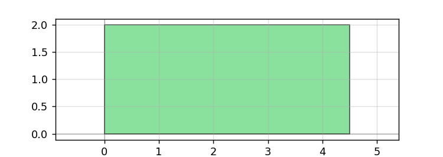

.. literalinclude:: gen_geometry.py
   :language: python
   :dedent: 0
   :start-after: example-bbox
   :end-before: create_image

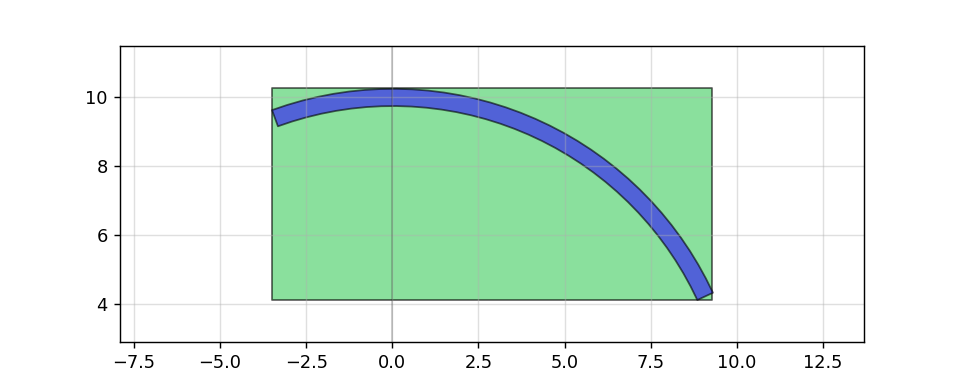

***********
Cross
***********

.. literalinclude:: gen_geometry.py
   :language: python
   :dedent: 0
   :start-after: example-cross
   :end-before: create_image

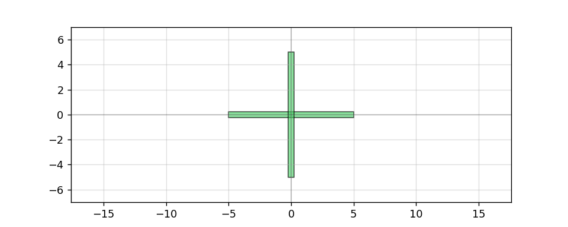

***********
Ellipse
***********

.. literalinclude:: gen_geometry.py
   :language: python
   :dedent: 0
   :start-after: example-ellipse
   :end-before: create_image

.. image:: _static/ellipse.png
   :align: center

***********
Circle
***********

.. literalinclude:: gen_geometry.py
   :language: python
   :dedent: 0
   :start-after: example-circle
   :end-before: create_image

.. image:: _static/circle.png
   :align: center

***********
Ring
***********

.. literalinclude:: gen_geometry.py
   :language: python
   :dedent: 0
   :start-after: example-ring
   :end-before: create_image

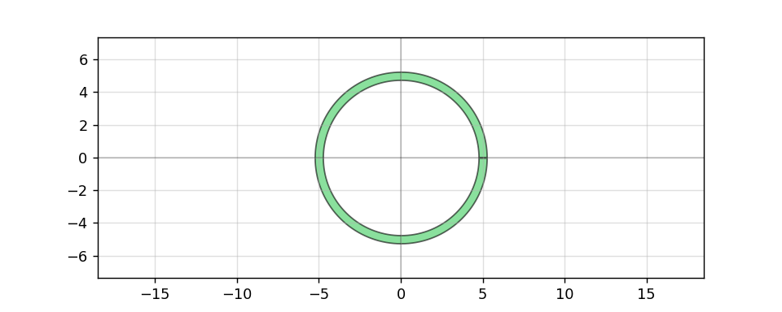

***********
Arc
***********

.. literalinclude:: gen_geometry.py
   :language: python
   :dedent: 0
   :start-after: example-arc
   :end-before: create_image

.. image:: _static/arc.png
   :align: center

***********
Simple shapes
***********

.. literalinclude:: gen_geometry.py
   :language: python
   :dedent: 0
   :start-after: example-straight
   :end-before: create_image

.. image:: _static/straight.png
   :align: center

.. literalinclude:: gen_geometry.py
   :language: python
   :dedent: 0
   :start-after: example-L
   :end-before: create_image

.. image:: _static/L.png
   :align: center

.. literalinclude:: gen_geometry.py
   :language: python
   :dedent: 0
   :start-after: example-C
   :end-before: create_image

.. image:: _static/C.png
   :align: center

###############
Boolean / outline / offset
###############

.. literalinclude:: gen_geometry.py
   :language: python
   :dedent: 0
   :start-after: example-offset
   :end-before: create_image

.. image:: _static/offset.png
   :align: center

.. literalinclude:: gen_geometry.py
   :language: python
   :dedent: 0
   :start-after: example-invert
   :end-before: create_image

.. image:: _static/invert.png
   :align: center

.. literalinclude:: gen_geometry.py
   :language: python
   :dedent: 0
   :start-after: example-boolean
   :end-before: create_image

.. literalinclude:: gen_geometry.py
   :language: python
   :dedent: 0
   :start-after: example-outline
   :end-before: create_image

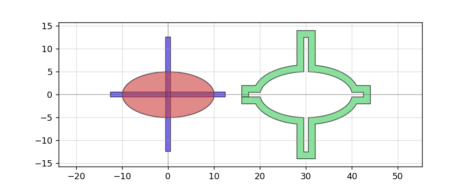

.. literalinclude:: gen_geometry.py
   :language: python
   :dedent: 0
   :start-after: example-xor_diff
   :end-before: create_image

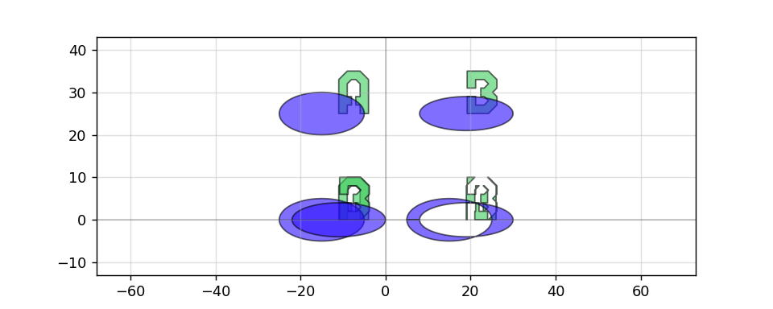

.. literalinclude:: gen_geometry.py
   :language: python
   :dedent: 0
   :start-after: example-union
   :end-before: create_image

.. literalinclude:: gen_geometry.py
   :language: python
   :dedent: 0
   :start-after: example-litho_steps
   :end-before: create_image

.. literalinclude:: gen_geometry.py
   :language: python
   :dedent: 0
   :start-after: example-litho_star
   :end-before: create_image

.. literalinclude:: gen_geometry.py
   :language: python
   :dedent: 0
   :start-after: example-litho_calipers
   :end-before: create_image

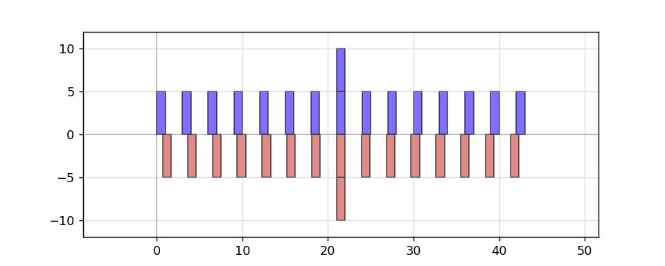

.. literalinclude:: gen_geometry.py
   :language: python
   :dedent: 0
   :start-after: example-extract
   :end-before: create_image

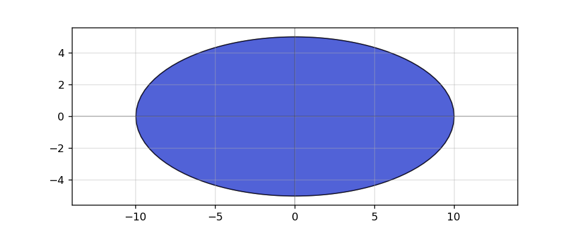

.. literalinclude:: gen_geometry.py
   :language: python
   :dedent: 0
   :start-after: example-copy
   :end-before: create_image

.. image:: _static/copy.png
   :align: center

.. literalinclude:: gen_geometry.py
   :language: python
   :dedent: 0
   :start-after: example-deepcopy
   :end-before: create_image

.. image:: _static/deepcopy.png
   :align: center

.. literalinclude:: gen_geometry.py
   :language: python
   :dedent: 0
   :start-after: example-copy_layer
   :end-before: create_image

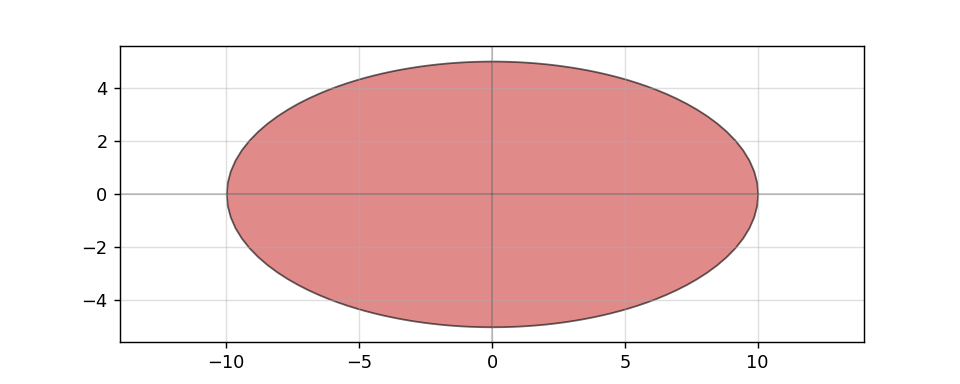

.. literalinclude:: gen_geometry.py
   :language: python
   :dedent: 0
   :start-after: example-import_gds
   :end-before: create_image

.. literalinclude:: gen_geometry.py
   :language: python
   :dedent: 0
   :start-after: example-preview_layerset
   :end-before: create_image

.. image:: _static/preview_layerset.png
   :align: center

.. literalinclude:: gen_geometry.py
   :language: python
   :dedent: 0
   :start-after: example-connector
   :end-before: create_image

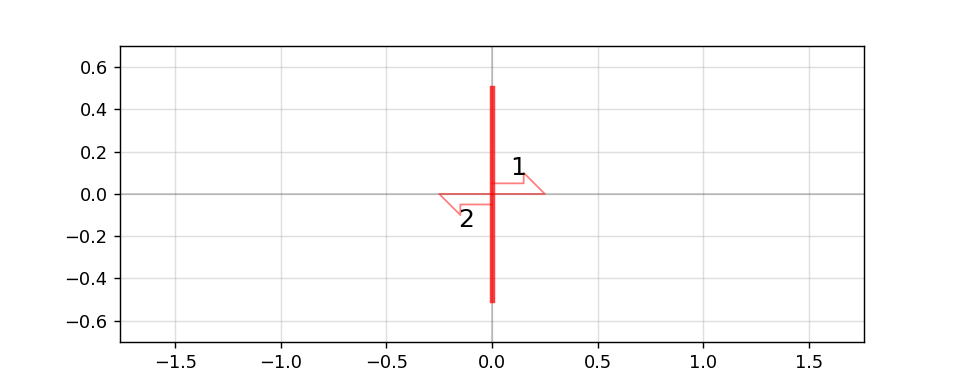

.. literalinclude:: gen_geometry.py
   :language: python
   :dedent: 0
   :start-after: example-compass
   :end-before: create_image

.. image:: _static/compass.png
   :align: center

.. literalinclude:: gen_geometry.py
   :language: python
   :dedent: 0
   :start-after: example-compass_multi
   :end-before: create_image

.. image:: _static/compass_multi.png
   :align: center

.. literalinclude:: gen_geometry.py
   :language: python
   :dedent: 0
   :start-after: example-flagpole
   :end-before: create_image

.. literalinclude:: gen_geometry.py
   :language: python
   :dedent: 0
   :start-after: example-tee
   :end-before: create_image

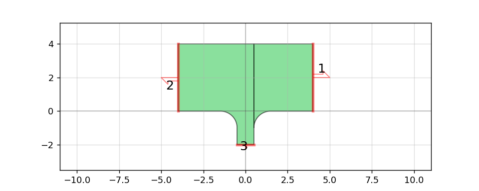

.. literalinclude:: gen_geometry.py
   :language: python
   :dedent: 0
   :start-after: example-taper
   :end-before: create_image

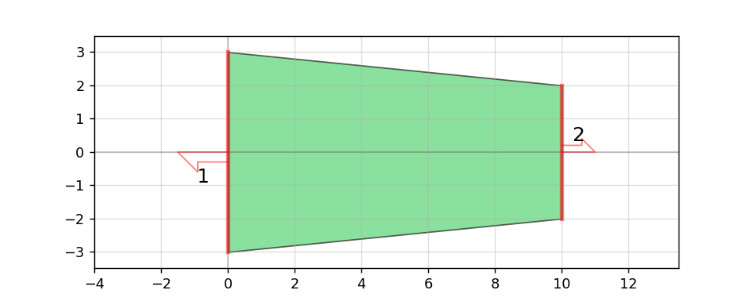

.. literalinclude:: gen_geometry.py
   :language: python
   :dedent: 0
   :start-after: example-ramp
   :end-before: create_image

.. image:: _static/ramp.png
   :align: center

.. literalinclude:: gen_geometry.py
   :language: python
   :dedent: 0
   :start-after: example-text
   :end-before: create_image

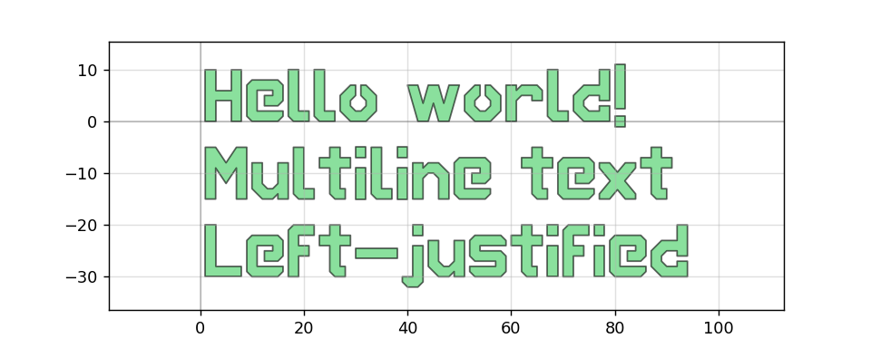

.. literalinclude:: gen_geometry.py
   :language: python
   :dedent: 0
   :start-after: example-basic_die
   :end-before: create_image

.. literalinclude:: gen_geometry.py
   :language: python
   :dedent: 0
   :start-after: example-fill_rectangle
   :end-before: create_image

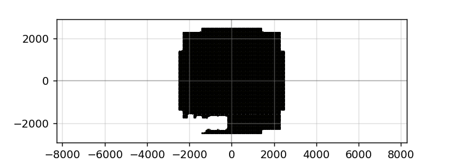

.. literalinclude:: gen_geometry.py
   :language: python
   :dedent: 0
   :start-after: example-grating
   :end-before: create_image

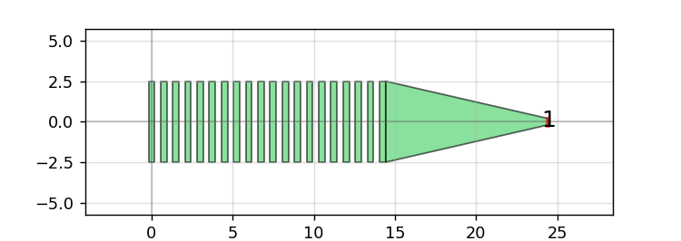

.. literalinclude:: gen_geometry.py
   :language: python
   :dedent: 0
   :start-after: example-test_via
   :end-before: create_image

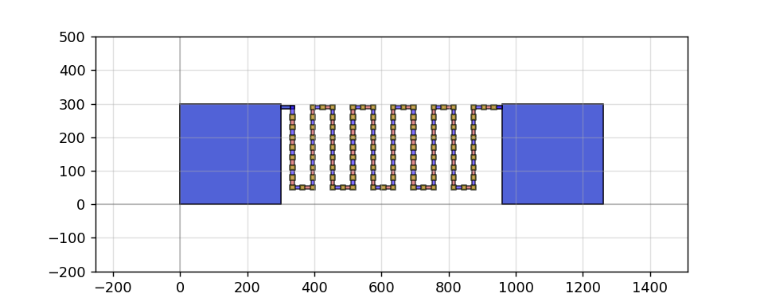

.. literalinclude:: gen_geometry.py
   :language: python
   :dedent: 0
   :start-after: example-test_comb
   :end-before: create_image

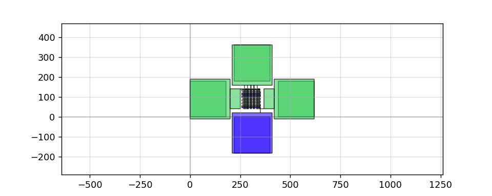

.. literalinclude:: gen_geometry.py
   :language: python
   :dedent: 0
   :start-after: example-test_ic
   :end-before: create_image

.. literalinclude:: gen_geometry.py
   :language: python
   :dedent: 0
   :start-after: example-test_res
   :end-before: create_image

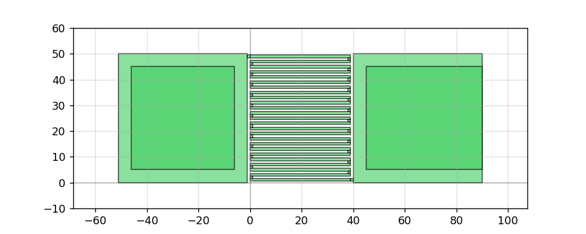

.. literalinclude:: gen_geometry.py
   :language: python
   :dedent: 0
   :start-after: example-optimal_hairpin
   :end-before: create_image

.. image:: _static/optimal_hairpin.png
   :align: center

.. literalinclude:: gen_geometry.py
   :language: python
   :dedent: 0
   :start-after: example-optimal_step
   :end-before: create_image

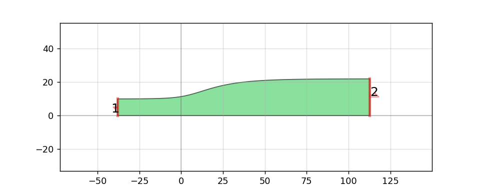

.. literalinclude:: gen_geometry.py
   :language: python
   :dedent: 0
   :start-after: example-optimal_90deg
   :end-before: create_image

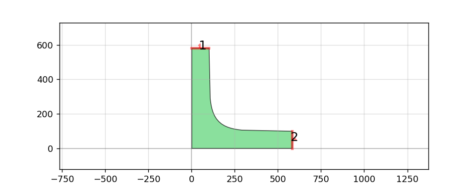

.. literalinclude:: gen_geometry.py
   :language: python
   :dedent: 0
   :start-after: example-snspd
   :end-before: create_image

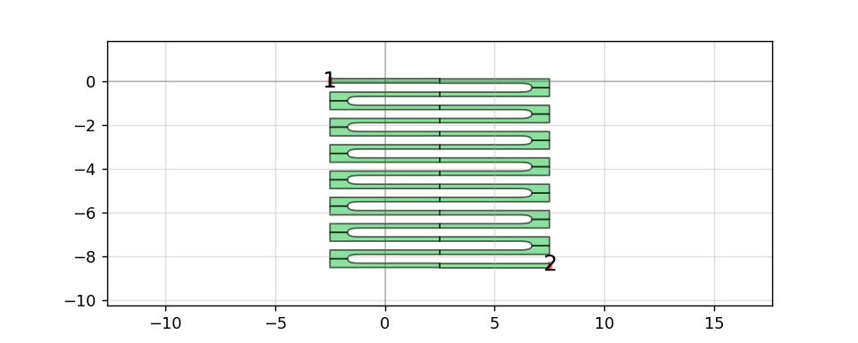

.. literalinclude:: gen_geometry.py
   :language: python
   :dedent: 0
   :start-after: example-snspd_expanded
   :end-before: create_image

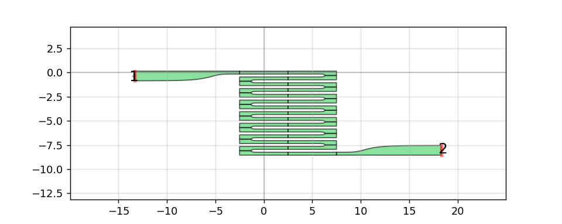

Subsub heading
====================

Welcome to phidl's documentation!
=================================

.. toctree::
   :maxdepth: 2
   :caption: Contents:

Indices and tables
==================

* :ref:`genindex`
* :ref:`modindex`
* :ref:`search`
